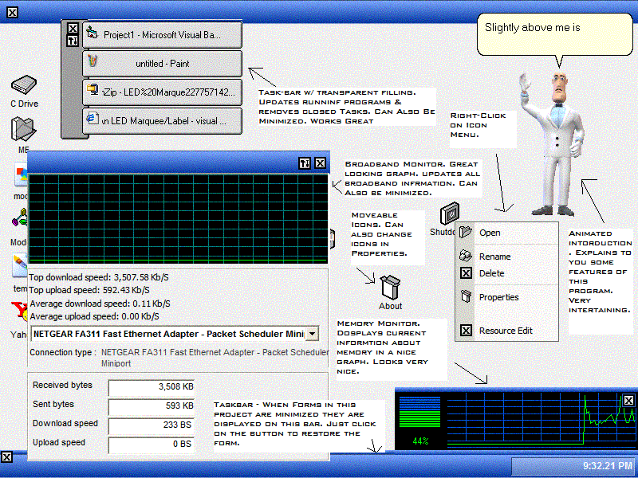



## \[SHELL XP\] version 1 \- NEW windows shell, everything works\! Great Layout \[Test Version\]

### Description

This loads a nice skin over top of you running windows. I have taken a look at many simular programs, looked to see what had been done wrong, and ade it right on my program. This is very appealing to the eye. EVERYING WORKS! No external OCX or DLL files! Everything is included in the 1 source file! Includes Fade In/Out on forms, Transparency, Working taskbar, Bandwidth monitor, memory Monitor, MS AGENT helper, customizeable shortcuts, and so much more.

Thyis is my test version. I only have windows XP so i was unable to test it on other platforms. It should work thought. I am open to any suggestions. This source is easily customizeable so feel free to creat your own.

UPDATE: I got all the file uploaded in this zip file... I foyu want the MSAgent (animated helper) to work you will need to download this file: http://ocasd.usachoice.net/james.zip

Extract the file to the projects directory (app.path for those who fidn that easier to understand) and it should work fine. If oyu do not when the project starts up you will receive and error on form3. To aviod this error without downloading the file from ftp://ocasd.usachoice.net/james.zip , just simply open up form 1, and remove the "load form3" command from the timer.
 
### More Info
 
UPDATE: I got all the file uploaded in this zip file... I foyu want the MSAgent (animated helper) to work you will need to download this file: http://ocasd.usachoice.net/james.zip

Extract the file to the projects directory (app.path for those who fidn that easier to understand) and it should work fine. If oyu do not when the project starts up you will receive and error on form3. To aviod this error without downloading the file from ftp://ocasd.usachoice.net/james.zip , just simply open up form 1, and remove the "load form3" command from the timer.

             |
---                |---
**Submitted On**   |2004-01-03 21:50:42
**By**             |[Eric Wolcott](https://github.com/Planet-Source-Code/PSCIndex/blob/master/ByAuthor/eric-wolcott.md)
**Level**          |Advanced
**User Rating**    |4.1 (58 globes from 14 users)
**Compatibility**  |VB 3\.0, VB 4\.0 \(16\-bit\), VB 5\.0, VB 6\.0
**Category**       |[Windows API Call/ Explanation](https://github.com/Planet-Source-Code/PSCIndex/blob/master/ByCategory/windows-api-call-explanation__1-39.md)
**World**          |[Visual Basic](https://github.com/Planet-Source-Code/PSCIndex/blob/master/ByWorld/visual-basic.md)
**Archive File**   |[\[SHELL\_XP\]169013142004\.zip](https://github.com/Planet-Source-Code/eric-wolcott-shell-xp-version-1-new-windows-shell-everything-works-great-layout-test-versi__1-50768/archive/master.zip)

